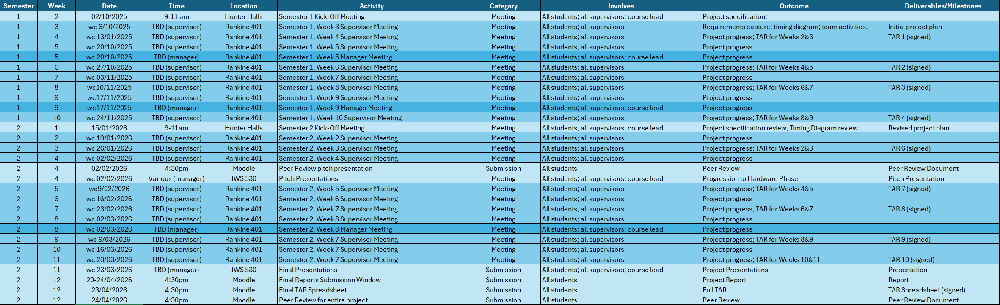

# Robotics_TDP_Team_7
This is the code respository for UoG Robotics_TDP Team 7

## Goals
- Accurate digital twin: NAO6 kinematics/dynamics, 9×6m pitch, ball (≈14cm Ø)
- Role behaviours: Striker, Defender, Goalkeeper, plus formation logic
- Fully autonomous control, guidance, and navigation reacting to state of play
- Robust tests, clear docs, and reproducible results

## Project Schedule

